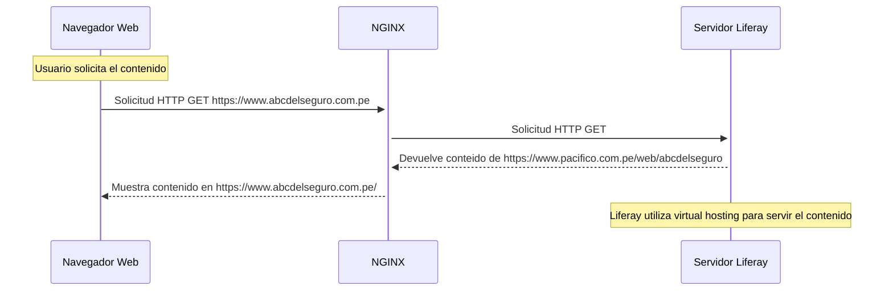

# Documentación del Caso de Uso para la Redirección

## Estructura

## contexto

La web corporativa se encuentra en Liferay, al igual que la web del ABC del Seguro. A través de Liferay, se hace un virtual host para que el contenido creado en Liferay con la ruta `https://www.pacifico.com.pe/web/abcdelseguro` apunte hacia el dominio `https://www.abcdelseguro.com.pe`. Esto significa que cuando los usuarios visiten `https://www.abcdelseguro.com.pe`, verán el contenido alojado en Liferay en la ruta `https://www.pacifico.com.pe/web/abcdelseguro`, pero en el navegador aparecerá el dominio `https://www.abcdelseguro.com.pe` debido a la configuración de virtual host en Liferay.

## Problematica

Se desea migrar los contenidos de `https://www.abcdelseguro.com.pe` hacia una nueva ruta dentro de la web corporativa: `https://www.pacifico.com.pe/web/abcdepacifico`y el equipo de contenidos requiere realizar una redirección para que cuando los usuarios visiten `https://www.abcdelseguro.com.pe`, sean redirigidos a `https://www.pacifico.com.pe/web/abcdepacifico`.

## Análisis

Al analizar la situación, se identificaron los siguientes puntos:

- Existe un problema de redirección infinita que debe ser solucionado.
- Se necesita una evaluación de los especialistas de SEO para comprender el impacto de redirigir una URL canónica a un subdirectorio de la web corporativa.

### Alternativas y Estrategias para Mitigar el Problema

### Desaparición de los Dominios Relacionados con el ABC de Seguros

- Se debe determinar si se eliminarán definitivamente los dominios relacionados con el ABC de Seguros.
- En caso afirmativo, se debe establecer un plazo para la eliminación de estos dominios y considerar los recursos asociados, como la vinculación con la IP del servidor Liferay.

### Consultas para el Especialista de SEO

- Se necesita comprender el impacto de redirigir una página con dominio propio a un subdirectorio en términos de SEO y URL canónica.
- Se debe definir si todas las páginas del ABC coexistirán con las páginas existentes en la web corporativa o si solo algunas serán redirigidas.

### Consultas Técnicas sobre Proxy Pass vs. Código de Redirección

**Proxy Pass:**

- **Ventajas:**
    - Permite mostrar el contenido de `https://www.pacifico.com.pe/web/abcdepacifico` en `https://www.abcdelseguro.com.pe` sin redireccionar al usuario.
    - Mantiene la apariencia del dominio original.
- **Desventajas:**
    - Requiere más recursos del servidor.
    - Puede generar problemas de caché y cookies.
    - Mayor complejidad en gestión y mantenimiento.

**Código de Redirección (301 Redirect):**

- **Ventajas:**
    - SEO-friendly, indicando a los motores de búsqueda que el contenido se movió permanentemente.
    - Simplifica la gestión del servidor.
- **Desventajas:**
    - Puede causar una caída temporal en el ranking de SEO.
    - Los usuarios ven la redirección.

### Recomendación

Para minimizar el impacto en SEO, se recomienda utilizar una redirección 301 (código de redirección permanente). Esto informará a los motores de búsqueda sobre el cambio y transferirá la autoridad de la URL antigua a la nueva.

### Documento Oficial sobre Pérdida de SEO

Se debe crear un documento oficial que detalle los riesgos, estrategias de mitigación y el consentimiento de los interesados. Debe incluir un análisis de la situación actual, estrategias de mitigación y aprobación formal de los interesados.

### Consulta con Arquitectos DevOps y de Soluciones

Se organizará una reunión con los arquitectos DevOps y de soluciones para revisar la configuración del servidor web (nginx) y discutir las mejores prácticas para implementar la redirección. Se revisará y ajustará cualquier configuración existente para evitar problemas de redirección infinita y uso excesivo de recursos.

### Plan de Acción

1. **Reunión con el Equipo de SEO:**
    - Discutir el impacto de la redirección en SEO y URL canónica.
    - Planificar estrategias de mitigación basadas en recomendaciones.
2. **Documentación Oficial:**
    - Preparar un documento detallado sobre los riesgos, estrategias de mitigación y consentimiento de los interesados.
3. **Implementación Técnica:**
    - Configurar una redirección 301 en el servidor web (nginx) de `https://www.abcdelseguro.com.pe` a `https://www.pacifico.com.pe/web/abcdepacifico`.
    - Realizar pruebas exhaustivas para garantizar su correcto funcionamiento.
4. **Monitoreo y Ajustes:**
    - Monitorear el rendimiento del servidor y el impacto en SEO post-implementación.
    - Realizar ajustes según sea necesario para optimizar el rendimiento y minimizar pérdidas en SEO.

Este plan asegura una transición suave, considerando aspectos técnicos y de SEO, minimizando impactos negativos en el servidor y en el posicionamiento en motores de búsqueda.